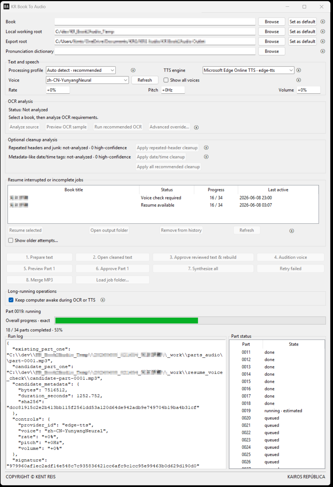
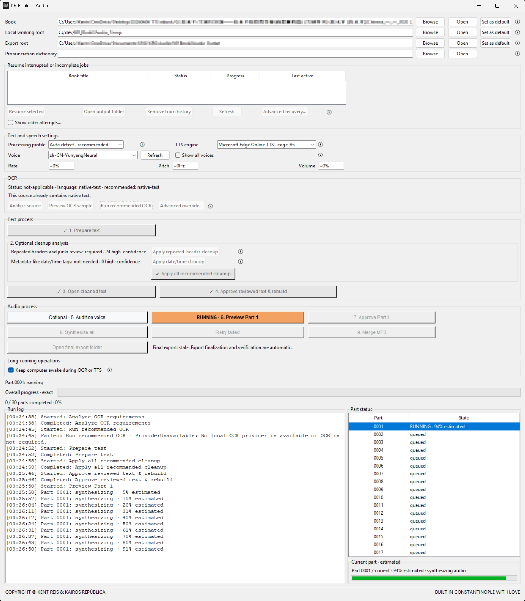
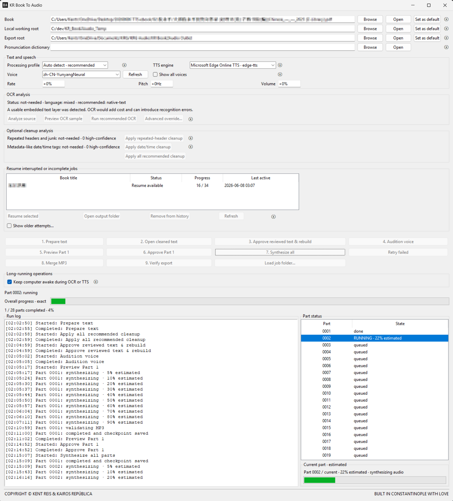

# KR Book To Audio

**Possibly the world's best book-to-audio conversion software.**<br>
**可能是全世界最好用的 Book-to-Audio 轉換軟體。**



Built by Kent Reis from Constantinople with love. AD May 20, 2026

Copyright © Kent Reis & Kairos República

It converts text-layer PDF, EPUB, MOBI or PalmDOC-compatible AZW or PRC, DOCX, TXT and Markdown sources into independently recoverable MP3 parts and an optional merged MP3 audiobook.

## Istanbul Release v2.3.0

This reliability architecture release replaces the single JSON job-state authority with a per-job SQLite transaction engine and adds responsive desktop behavior:

- authoritative resumable state now lives in `<job>\_work\state\job_state.sqlite3`;
- `job_manifest.json` remains as a human-readable derived snapshot and legacy compatibility surface;
- legacy JSON-only jobs migrate automatically while preserving `job_manifest.legacy.json`;
- SQLite uses WAL journaling, `synchronous=FULL`, bounded lock waiting, monotonic state revisions and a single-writer lease;
- stale state revisions are rejected instead of silently overwriting newer progress;
- product-owned file replacement uses unique sibling partial files, flush, `fsync`, serialized same-path writes and bounded retry;
- export finalization reuses verified MP3 receipts and avoids redundant `ffprobe` launches while preserving hash and readability guarantees;
- OCR actions become informational no-ops when a usable native text layer already exists;
- the initial desktop height adapts to the current screen, using 1900 px on the Owner 2160p display and a vertically scrollable compact layout on smaller screens.

## Historical interface evidence

The following screenshot records the real Owner-machine Istanbul Release v2.1.0 interface immediately before the SQLite durable-state and responsive-layout upgrade:



## Istanbul Release v2.1.0

This workflow and desktop-process reliability release removes visible child-console flashes and makes the GUI read like one sequential operating procedure:

- all console-style external tools route through one governed hidden-window adapter on Windows;
- `pdfinfo`, `pdffonts`, `pdftotext`, `pdftoppm`, `ffprobe`, `ffmpeg`, `tesseract` and `ocrmypdf` no longer launch raw subprocesses;
- operation-scoped Run log entries expose each hidden external-tool launch without leaking full local paths;
- the screen order is Paths, Recent jobs, Text and speech settings, OCR, Text process, Audio process, Runtime monitor and footer;
- primary workflow buttons are rendered from the authoritative manifest as completed, running, next, optional, blocked or failed;
- export finalization and verification remain mandatory but are fully automatic; the manual **Verify export** button is removed from the normal interface;
- manual job-folder loading moves under **Advanced recovery…**, reserved for a task missing from Recent jobs.

## Historical interface evidence

The following screenshot records the real Owner-machine Istanbul Release v2.0.1 interface before the v2.1.0 workflow-layout refactor:




## Istanbul Release 2.0

## Istanbul Release v2.0.1

This reliability patch separates internal checkpoint completion from externally verified deliverable completion:

- every successful full synthesis or retry completion automatically materializes validated Part MP3 files under the configured Export root;
- export copying is atomic: a `.partial.mp3` file is validated before it replaces the final exported Part;
- `export_manifest.json` records the verified deliverable tree;
- completed legacy jobs whose external export folder is empty are repaired automatically without regenerating speech;
- **Open output folder** no longer creates a misleading empty export directory; when finalization has not happened, it offers to open the internal working-audio folder instead;
- the Book, Local working root, Export root and Pronunciation dictionary rows now include direct **Open** actions.

The externally deliverable tree is:

```text
<Export root>\
    YYYYMMDD_HHMMSS_<Book title>\
        parts\
            part-0001.mp3
            part-0002.mp3
            ...
        <Book title>.mp3          # after Merge MP3
        export_manifest.json
```


The Istanbul Release 2.0 milestone adds a portable Windows x64 desktop distribution and makes long-running synthesis visibly auditable:

- double-click `KRBookToAudio.exe`; no Python command and no PowerShell window;
- timestamped, auto-scrolling runtime log for preparation, OCR, preview, guided resume, synthesis, retries and merge;
- green-highlighted active Part, auto-centered in the Part-status list;
- continuously changing estimated current-Part percentage and progress bar;
- exact overall completed-Part progress remains separate from estimated current-Part progress;
- `onedir` portable packaging keeps `_internal` visible and relocation-safe;
- Windows CI builds and smoke-tests the portable bundle before milestone publication;
- complete AI co-coder takeover handoff is mandatory for this integer Release.

## Istanbul Release v1.3.4

This branding-surface checkpoint adds the Owner-approved BA application icon and a restrained bottom footer:

- SVG remains the canonical branding source;
- PNG remains the desktop fallback asset;
- a multi-resolution Windows ICO is generated for title-bar, taskbar, Alt + Tab and future portable-executable reuse;
- missing icon assets never block application startup;
- the footer displays `COPYRIGHT © KENT REIS` and `KAIROS REPÚBLICA`.

The v1.3.2 durable-resume hotfix remains active.

## Istanbul Release v1.3.2

This hotfix completes the durable-resume user path:

- task-bound TTS controls are persisted in each manifest and MP3 sidecar;
- Resume selected restores provider, voice, rate, pitch and volume before continuing;
- legacy default controls are recovered safely by matching the stored audio signature;
- legacy custom controls that cannot be proven stop with an actionable Part-1 approval message instead of a low-level RuntimeError;
- default Recent jobs shows only the newest resumable attempt for each source book;
- synthesis resumes directly from the first incomplete Part.

The v1.3.1 Recent-jobs cleanup remains active:

- validation fixtures are isolated from the real application state root;
- stale missing-manifest history entries are pruned automatically;
- the desktop panel shows only interrupted or incomplete resumable tasks;
- resume statuses and last-active timestamps are rendered in compact human-readable form;
- the keep-awake control sits under a dedicated long-running-operations section;
- stable `execution_history.json` recent-job index stored beside the application root;
- authoritative per-job execution checkpoints in `job_manifest.json`;
- Recent jobs panel with one-click interrupted-task resume;
- stale lock recovery only after the prior process is confirmed dead;
- partial MP3 cleanup and conservative orphan-MP3 reconciliation;
- MP3 sidecars binding text hash and audio signature before manifest adoption;
- automatic Windows keep-awake during long OCR and TTS operations;
- OCR provider page-checkpoint capability declarations for future page-level resume;
- automatic OCR applicability and necessity analysis;
- local OCR capability discovery for PaddleOCR, Tesseract, OCRmyPDF, language packs and advisory GPU availability;
- automatic local OCR recommendation instead of forcing the operator to understand engine details;
- sample-page OCR preview before full-book OCR;
- provider registries shared by OCR and text-to-speech paths;
- reserved but disabled API adapter slots for OpenAI Vision, Claude Vision, Azure Speech, OpenAI TTS and custom HTTP providers;
- no cloud upload path enabled in this release;
- readonly TTS-engine selector with `Microsoft Edge Online TTS · edge-tts` as the only enabled provider;
- cached, refreshable voice dropdown with language-profile filtering and manual **Show all voices** override;
- processing-profile selector: auto, Chinese, English, mixed Chinese-English and general prose;
- automatic cleanup analysis with high-confidence action buttons and review-required preservation;
- estimated Part-1 and current-part progress, plus exact overall completed-part progress.

The v1.1.1 Windows PDF hotfix remains active: Poppler output is decoded bytes-first, and missing PDF metadata falls back safely to the source filename.

## Provider model

Three concepts are separated:

```text
OCR provider
Text processing profile
TTS provider and voice
```

The current enabled TTS provider is:

```text
edge-tts
```

The OCR advisor can discover and recommend local providers:

```text
paddleocr-ppocrv5
tesseract-local
ocrmypdf-tesseract
```

Reserved API adapter slots are disabled by default. They exist so future integrations can be added without rewriting the pipeline. Credentials must come from environment variables or a future Owner-local secret store. They are never stored in job manifests, logs or public GitHub files.

## Installation

Requirements:

- Python 3.11 or later;
- FFmpeg and `ffprobe` for audio validation and merge;
- Poppler commands (`pdfinfo`, `pdffonts`, `pdftotext`, `pdftoppm`) for PDF input and OCR rendering;
- `edge-tts` for the current online speech provider.

Install:

```bash
python -m pip install -e .
```

Optional local OCR engines are discovered automatically when installed:

```text
PaddleOCR
Tesseract
OCRmyPDF
```

The application does not auto-install large OCR dependencies.

## Desktop workflow

Portable Windows launch:

```text
Double-click KRBookToAudio.exe
```

Developer launch:

```bash
kr-book-to-audio-gui
```

Recommended workflow:

1. Select a source book.
2. Run **Analyze source** in the OCR section.
3. When OCR is required, preview sample OCR and run the recommended local OCR engine.
4. Select a processing profile or keep **Auto detect · recommended**.
5. Prepare text.
6. Review automatic cleanup recommendations. Apply only the recommended cleanup actions you accept.
7. Open and review the cleaned text.
8. Click **Approve reviewed text & rebuild**.
9. Refresh the voice list when needed, audition the selected voice and generate Part 1.
10. Approve Part 1 after listening.
11. Generate all parts and retry recorded failures when needed. After the final validated Part, the app automatically finalizes and verifies the external export tree.
12. Export finalization and verification run automatically after the final validated Part. Legacy completed tasks are repaired automatically when loaded or opened.
13. Merge only after Part export verification completes. Merge refreshes `export_manifest.json`.
14. When a prior run ended unexpectedly, select it under **Recent jobs** and click **Resume selected**. The app restores task-bound speech controls, reconciles trusted MP3 parts and continues from the first incomplete Part. Older attempts for the same source book remain preserved but are hidden from the default panel.

Changing the reviewed text, pronunciation dictionary, selected voice, speaking controls or TTS provider invalidates the relevant approval.

## Durable resume boundary

The application stores two persistence layers:

```text
Application-level recent-job index:
%LOCALAPPDATA%\KRBookToAudio\execution_history.json

Per-job authoritative state:
<job>\_work\state\job_state.sqlite3

Human-readable derived snapshot:
<job>\_work\job_manifest.json
```

If Windows sleeps, a terminal window closes or the Python process exits unexpectedly, validated MP3 parts remain reusable. On restart the desktop detects interrupted work, clears stale locks only after confirming that the prior PID is dead, deletes residual `.partial.mp3` files, reconciles trusted sidecar-bound orphan MP3 files and resumes from the first incomplete Part.

The application-level index is rebuildable navigation state. Each job manifest remains authoritative. Removing an entry from **Recent jobs** does not delete files.

Windows keep-awake is enabled by default during long OCR and TTS operations. It blocks automatic sleep only; it does not block manual sleep, shutdown or lid-close policy.

## OCR boundary

The application prefers native text and avoids OCR when a reliable text layer already exists.

For scanned PDF sources, the advisor:

```text
analyzes representative pages
detects language characteristics
discovers local capabilities
recommends a local OCR provider
supports sample preview before full OCR
```

Cloud OCR adapters are reserved but disabled. No page is uploaded to a remote API in v1.3.2.

## Optional cleanup boundary

Cleanup analysis reports:

```text
not-needed
recommended
review-required
```

Only high-confidence candidates can be removed by action buttons. Ambiguous repeated text remains preserved for human review.

## Command-line examples

```bash
kr-book-to-audio providers
kr-book-to-audio ocr-analyze scan.pdf
kr-book-to-audio ocr-preview scan.pdf
kr-book-to-audio ocr-run scan.pdf --output-dir OCR_OUTPUT
kr-book-to-audio prepare book.epub --profile auto --dictionary pronunciation.json
kr-book-to-audio cleanup PATH_TO_JOB metadata-date-time-tags
kr-book-to-audio cleanup PATH_TO_JOB repeated-headers-and-junk
kr-book-to-audio approve-proofread PATH_TO_JOB --dictionary pronunciation.json
kr-book-to-audio audition --engine edge-tts --voice zh-CN-YunyangNeural --rate +0%
kr-book-to-audio preview PATH_TO_JOB --engine edge-tts --voice zh-CN-YunyangNeural --rate +0%
kr-book-to-audio approve-preview PATH_TO_JOB --engine edge-tts --voice zh-CN-YunyangNeural --rate +0%
kr-book-to-audio tts PATH_TO_JOB --engine edge-tts --voice zh-CN-YunyangNeural --rate +0%
kr-book-to-audio retry-failed PATH_TO_JOB --engine edge-tts --voice zh-CN-YunyangNeural --rate +0%
kr-book-to-audio merge PATH_TO_JOB
kr-book-to-audio finalize-export PATH_TO_JOB
kr-book-to-audio verify-export PATH_TO_JOB
kr-book-to-audio verify-export PATH_TO_JOB --require-merged
kr-book-to-audio recent-jobs --rebuild
kr-book-to-audio recover PATH_TO_JOB
```

## Input boundary

Supported directly:

- text-layer PDF and OCR-produced PDF;
- EPUB;
- MOBI and PalmDOC-compatible AZW or PRC;
- DOCX;
- TXT and Markdown.

Not supported directly:

- AZW3 or Kindle Format 8;
- tables, formulas or figure-dependent material where visual meaning cannot survive audio conversion.

## License

No open-source license has been granted yet. Copyright remains with the project owner unless a later release states otherwise.


## Guided legacy resume

When an older task lacks a complete speech-control snapshot, the desktop does not guess. It preserves completed MP3 files, opens the preserved Part 1 and a candidate Part 1 preview, asks the operator to compare them, and resumes automatically from the first incomplete Part only after explicit approval. Recent jobs collapse older attempts by source hash, normalized source path or ordered part-text aggregate hash. Older attempts remain available through **Show older attempts…**.

## CI release gate

The publisher waits for the GitHub Actions `main` workflow to pass before it creates a tag or GitHub Release. A red remote workflow blocks Release creation.
