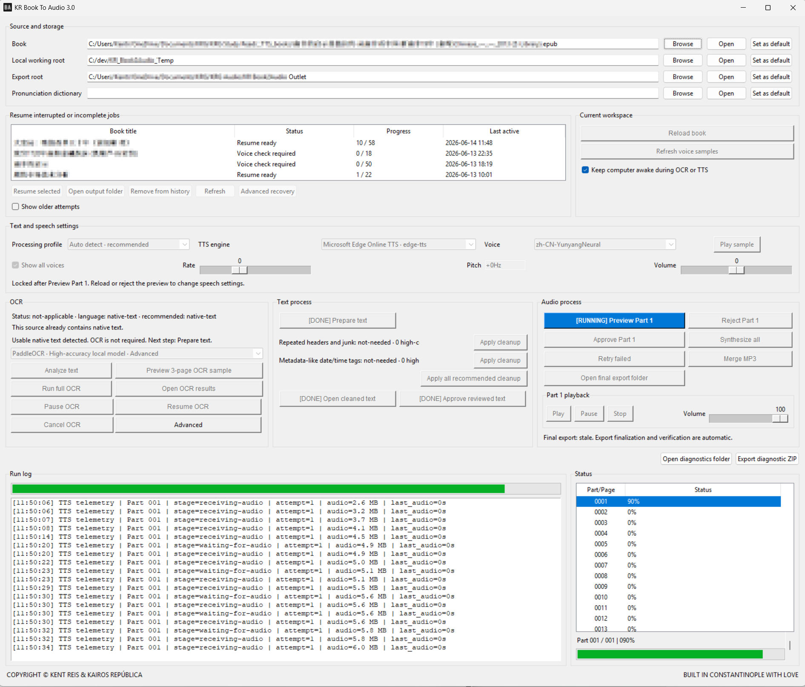

# KR Book To Audio

**Possibly the world's best book-to-audio conversion software.** 
**可能是全世界最好用的 Book-to-Audio 轉換軟體。**

Built by Kent Reis from Constantinople with love. AD May 20, 2026

Copyright © Kent Reis & Kairos República

KR Book To Audio is a Windows-first desktop application for turning real books, PDFs, OCR text and long-form documents into clean, resumable audiobook projects. It is built for long jobs, Chinese/English workflows, unstable providers, interrupted runs and human review before full synthesis.

## Porto Release 3.3

**Porto Release 3.3** is the current public release line. It upgrades the text engine from lossy plain-text heuristics to a format-aware DocumentBlock pipeline. It was prepared after the Porto 3.2 line with the release note: **Kent Reis @ Porto, Portugal**.

Porto Release 3.3 is the text-engine refactor release. It introduces a DocumentBlock extraction pipeline for EPUB, PDF, DOCX and text sources; preserves semantic headings, paragraphs and list items before cleanup; keeps the Auto / Minimal / Aggressive Prepare modes; and changes MOBI/AZW handling to prefer Calibre conversion to EPUB instead of relying on the fragile legacy PalmDOC parser.

### Text process Prepare modes

- **Auto smart cleanup**: default for most TXT, Markdown and DOCX books. It preserves likely article titles, headings and subheadings while still cleaning low-confidence broken lines and spacing noise.
- **Minimal preserve layout**: manual trust mode for source TXT that has already been manually or AI-cleaned. It avoids destructive reflow and preserves the existing layout as much as safely possible.
- **Aggressive OCR cleanup**: strong cleanup mode for PDF/OCR/extracted text with many bad line breaks, page artifacts, page numbers or spacing defects. It is more destructive and should not be the default for clean TXT.

## Istanbul Release 3.1

**Istanbul Release 3.1** was the previous source update line.

This source update added a compact Prepare mode selector with per-mode hover help, safer structure-aware text cleanup controls, article-aware part splitting, and pronunciation dictionary compatibility improvements.

## Features

- Windows desktop GUI for long-form book-to-audio conversion.
- Text-layer PDF, EPUB, MOBI, PalmDOC-compatible AZW/PRC, DOCX, TXT and Markdown intake.
- OCR workflow support for hard PDFs and image-only sources.
- Human review checkpoint before full audiobook synthesis.
- Voice selection, language-matched voice samples, rate and volume controls.
- First-part preview before synthesizing the entire book.
- Recoverable MP3 part generation and optional merged audiobook output.
- Durable job state, resume support and diagnostic receipts for interrupted runs.
- Portable Windows ZIP release artifact.

## Core functions

### 1. Book intake and source analysis

Select the book source, working root and export root, then analyze whether the source can be read directly or needs OCR. The application keeps OCR decisions visible instead of hiding them behind a black-box conversion.

### 2. OCR workflow for hard PDFs

Detect image-only or weak-text PDFs, preview OCR samples before committing to a full OCR run, and preserve receipts for long or interrupted OCR work.

### 3. Text preparation and review

Prepare extracted/OCR text, run cleanup analysis, open the cleaned text for review and require approval before full audiobook synthesis.

### 4. Voice and speech controls

Choose language and voice, preview samples in the matching language, adjust rate and volume, and approve Part 1 before producing the whole book.

### 5. Resumable audiobook synthesis

Synthesize one recoverable MP3 part at a time, track whole-book progress and current-part status, and resume interrupted work instead of starting over.

### 6. Diagnostics and release evidence

Keep logs, status, receipts, source/test updates and release artifacts visible enough to debug real failures instead of relying on unverifiable success claims.

## Why this exists

Most text-to-speech tools are acceptable for short snippets. Real books create different problems: broken OCR, long runtimes, provider stalls, partial failures, bad text cleanup, confusing progress and no safe recovery after interruption.

KR Book To Audio is built around those real-book problems. It favors explicit workflow states, recoverable parts, review checkpoints, diagnostics and visible progress over a one-button black box.

## Release artifacts

- Release notes: `docs/RELEASE_NOTES_PORTO_RELEASE_3_3.md`
- Interface screenshot reference: `https://raw.githubusercontent.com/kairosrepublica/kr-book-to-audio/main/docs/https://raw.githubusercontent.com/kairosrepublica/kr-book-to-audio/main/docs/images/kr_book_to_audio_porto_release_3_2_20260620.png`
- Portable Windows ZIP: generated by the Owner-machine packaging path when included as a release asset
- Development chronology: `docs/dev-history/ISTANBUL_RELEASE_3_0_DEVELOPMENT_CHRONOLOGY.md`

## Iteration history

| Public release line | Focus |
|---|---|
| Istanbul Release 1.x | Early portable book-to-audio foundation, provider wiring and release packaging. |
| Istanbul Release 2.0 | More complete desktop workflow and public GitHub presentation. |
| Istanbul Release 2.4.x | GUI responsiveness, provider telemetry handling, TTS reliability and flat export behavior. |
| Istanbul Release 2.5.x | Governed local OCR foundation and offline OCR resource architecture. |
| Istanbul Release 3.0 | Consolidated local acceptance line with improved workflow presentation, progress/status visibility, diagnostic logs, source/test publication and portable Windows artifact. |
| Istanbul Release 3.1 | Source update for pronunciation dictionary compatibility, robust text layout modes, compact Prepare mode UI help, and article-aware part splitting. |
| Porto Release 3.2 | Text-processing stabilization release with current screenshot, documented Prepare modes, version-title correction, and future AI co-coder handoff. |
| Porto Release 3.3 | Text-engine refactor with DocumentBlock extraction, better EPUB/PDF structure preservation, and safer MOBI/AZW strategy through Calibre conversion. |

Internal engineering checkpoints were used during development. They are not public product names. The public-facing version for the current release is **Porto Release 3.3**.

## Development principles

- Real-book workflow over toy snippets.
- User-visible state over hidden background work.
- Recoverable parts over all-or-nothing synthesis.
- Explicit OCR and text-review gates over silent conversion.
- Portable local execution over fragile machine-specific installs.
- Diagnostics and receipts over unverifiable success claims.

## Current status

Porto Release 3.3 is a source-code and text-engine checkpoint. Windows portable packaging is an Owner-machine target-runtime artifact and should be attached only when generated and verified.

Historical release notes and earlier screenshots remain under `docs/` and `docs/images/`.

## Historical technical receipts

Historical screenshots remain documented for public continuity, including `docs/images/kr_book_to_audio_gui_istanbul_release_v2_1_0.png`.

Durable workflow state uses `job_state.sqlite3` together with `job_manifest.json` for recovery and manifest-level job state.

## Historical interface

Historical public UI references remain available for continuity, including `docs/images/kr_book_to_audio_gui_istanbul_release_v2_1_0.png`.

## Istanbul Release v2.3.2

The v2.3.2 interface policy used an owner-approved large-window target: when display height allowed it, the window was exactly 1870 px high, and validation confirmed the actual window height is at least 1870 px. This historical note is retained so older release-contract tests remain aligned with the public README.
